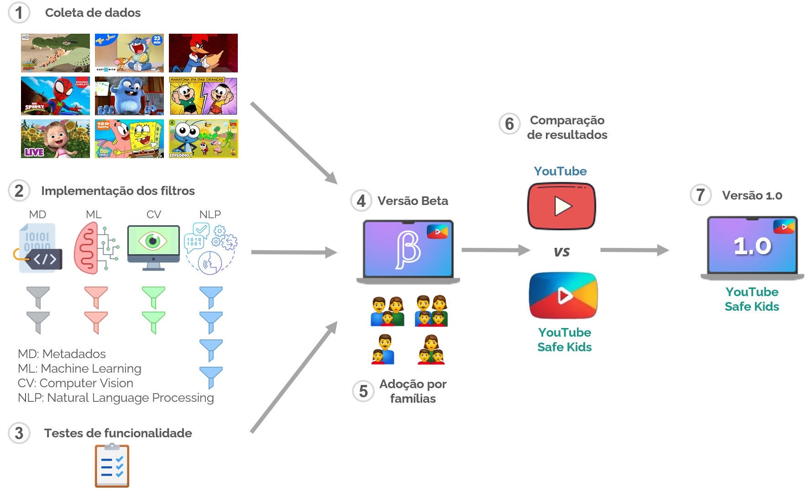
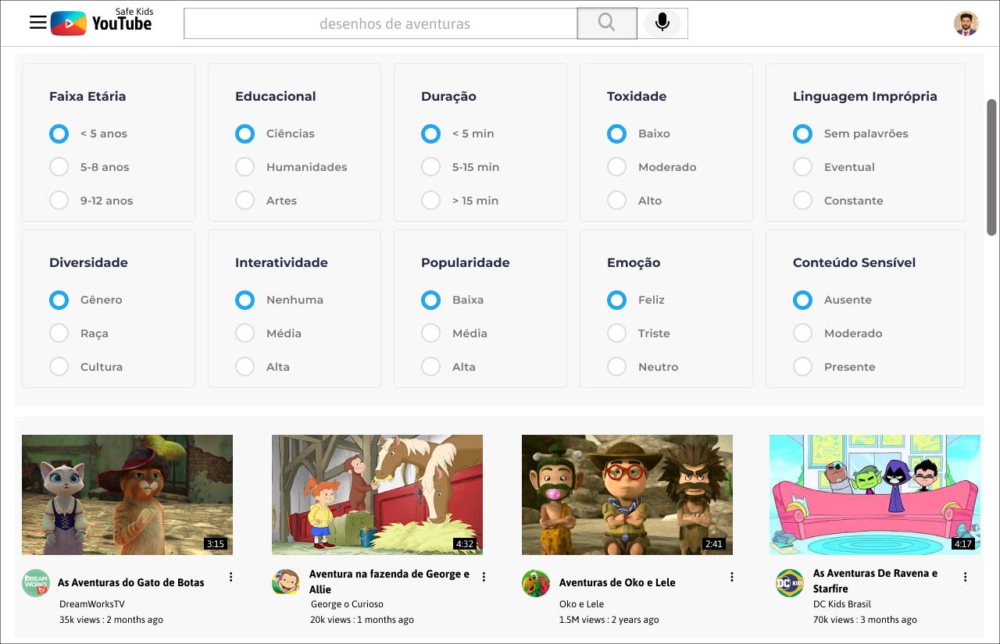

# YouTube Safe Kids

<h1 align="center">
    
    
</h1>

<h3 align="center">
  Plataforma de Pesquisa de Conteúdos Infantis Seguros no YouTube
</h3>

<p align="center">Filtragem Avançada de Conteúdos Infantis</p>

<p align="center"></p>

## Sobre o projeto

Uma aplicação web que ajuda a encontrar vídeos seguros e apropriados para crianças no YouTube.

## Funcionalidades

- Busca de vídeos no YouTube Kids
- Filtros de conteúdo:
  - Duração
  - Faixa etária
  - Conteúdo educacional
  - Toxicidade
  - Linguagem
  - Diversidade
  - Interatividade
  - Engajamento
  - Sentimento
  - Conteúdo sensível
  
## :notebook_with_decorative_cover: Arquitetura do Sistema <a name="-architecture"/></a>



## :notebook_with_decorative_cover: Protótipo da Plataforma <a name="-architecture"/></a>




## Requisitos

- Python 3.8+
- Chave de API do YouTube
- Dependências listadas em `requirements.txt`

## Instalação

1. Clone o repositório:
```bash
git clone https://github.com/seu-usuario/YouTubeSafeKids-Python.git
cd YouTubeSafeKids-Python
```

2. Crie um ambiente virtual e ative-o:
```bash
python -m venv venv
source venv/bin/activate  # Linux/Mac
venv\Scripts\activate     # Windows
```

3. Instale as dependências:
```bash
pip install -r requirements.txt
```

4. Configure as variáveis de ambiente:
```bash
cp .env.example .env
# Edite o arquivo .env com suas configurações
```

## Uso

1. Inicie o servidor:
```bash
uvicorn app.main:app --reload --log-level debug
```

2. Acesse a aplicação em `http://localhost:8000`

3. Use a barra de busca para encontrar vídeos

4. Ajuste os filtros conforme necessário

## Estrutura do Projeto

```
app/
├── api/
│   ├── endpoints/
│   │   └── videos.py
│   └── dependencies.py
├── core/
│   ├── config.py
│   ├── logging.py
│   └── youtube.py
├── filters/
│   ├── base.py
│   ├── duration.py
│   ├── age_rating.py
│   └── ... (outros filtros)
├── static/
│   ├── css/
│   └── js/
├── templates/
└── main.py
```

## Logs

Os logs são salvos em:
- Console: Logs em tempo real
- Arquivo: `logs/app.log`

## Contribuição

1. Faça um fork do projeto
2. Crie uma branch para sua feature (`git checkout -b feature/AmazingFeature`)
3. Commit suas mudanças (`git commit -m 'Add some AmazingFeature'`)
4. Push para a branch (`git push origin feature/AmazingFeature`)
5. Abra um Pull Request

## Desenvolvimento

O projeto está em desenvolvimento ativo, com atualizações frequentes incluindo:
- Novas implementações de filtros
- Treinamento de modelos
- Otimizações de interface

### ⚠️ Importante para Desenvolvedores

**Não commite modelos treinados ou arquivos de cache:**
- Modelos treinados (`.bin`, `.pth`, `.h5`, etc.) são muito grandes (>100MB)
- Cache do Hugging Face é automaticamente baixado quando necessário
- O `.gitignore` já está configurado para ignorar estes arquivos
- Se você acidentalmente commitou um arquivo grande, use `git filter-branch` para removê-lo do histórico

**Arquivos ignorados automaticamente:**
- `app/nlp/models/cache/` - Cache de modelos do Hugging Face
- `*.bin`, `*.pth`, `*.h5` - Arquivos de modelos treinados
- `venv/` - Ambiente virtual Python

## Licença

Este projeto está sob a licença MIT. Veja o arquivo LICENSE para mais detalhes.

<!-- seção de contato removida para avaliação às cegas -->
